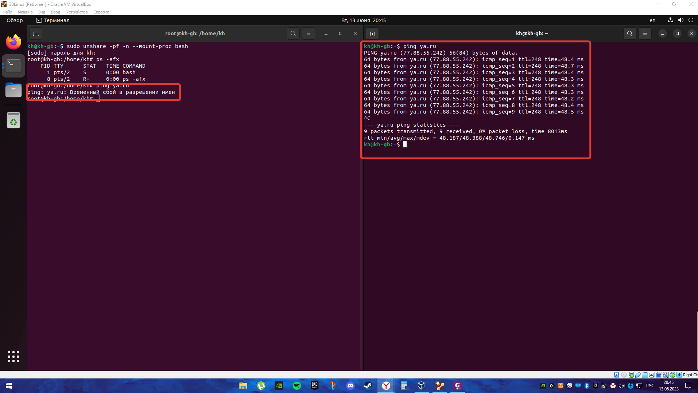
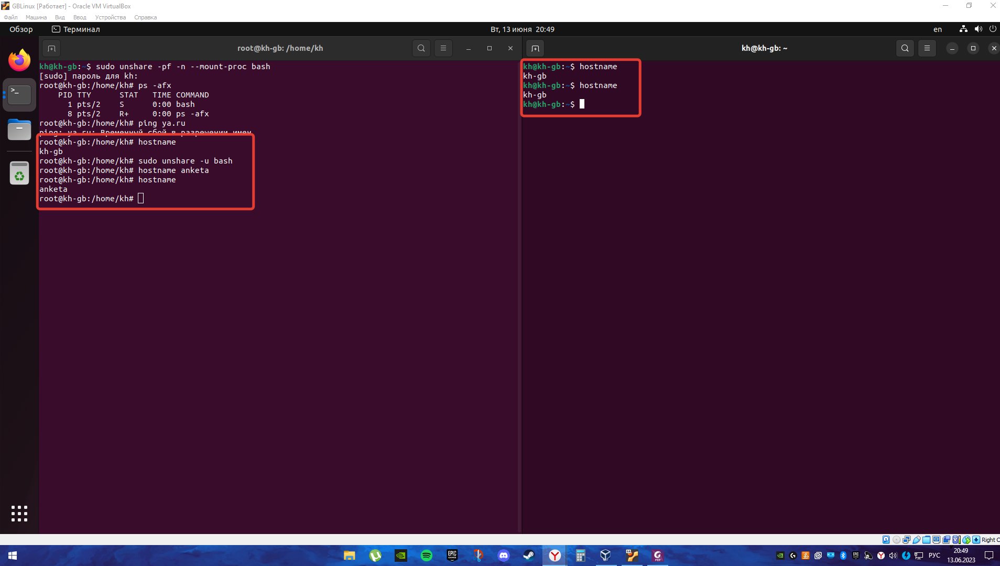

# Контейнеризация ДЗ-1

## Задание: необходимо продемонстрировать изоляцию одного и того же приложения (как решено на семинаре - командного интерпретатора) в различных пространствах имен.

* Запустим Bash в левом терминале с новым пространством имен командой (так как команда требует привилегии суперпользователя, то выполняем через sudo):
```
sudo unshare -pf -n --mount-proc bash
```

* В правом терминале смотрим, что произошло:
```
ps -afx
```


* Видим, что было создано несколько процессов, использующих Bash. В созданном пространстве имен с процессами совершенно другая картина. Изолированность №1 доказана.

* Пинганем яндекс на обоих терминалах и проверим что будет.

```
ping ya.ru
```


* Как видно, в изолированном пространстве имен пинг не проходит ввиду установленных ограничений. А в "чистом" терминале все отлично пингуется.

* Посмотрим hostname. Для этого используем на обоих терминалах команду hostname. Они одинаковы. Теперь выполним команду:

```
sudo unshare -u bash
```

Команда ``` unshare ``` запускает bash в новом пространстве имен, а флаг -u указывавет на UTS-пространство имен, а значит мы можем безвредно поменять hostname на изолированном терминале.


```
hostname anketa
```




Изменение hostname внутри изолированного пространства имен не повлияло на hostname на "чистом" терминале. Изолированность №2 доказана.