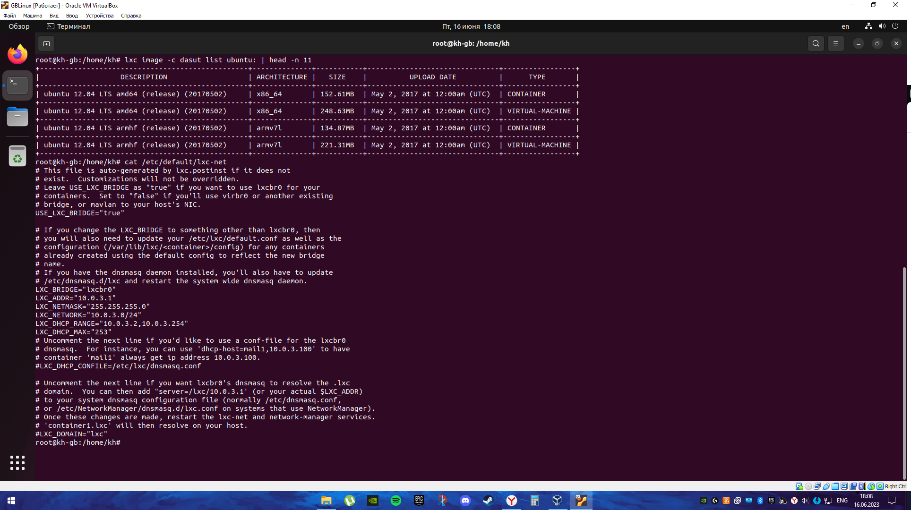

# Контейнеризация ДЗ-2

## Задание: 
1. запустить контейнер с ubuntu, используя механизм LXC
2. ограничить контейнер 256 Мб ОЗУ и проверить, что ограничение работает
Задание по желанию ..
4. '' добавить автозапуск контейнеру, перезагрузить ОС и убедиться, что контейнер действительно запустился самостоятельно
5. ''при создании указать файл, куда записывать логи
6. ''после перезагрузки проанализировать логи

* Для начала покажем процесс инициализации и списки, касающиеся образов

```
lxd init
lxc storage list
lxc network list
lxc remote list
```


```
lxc image -c dasut list ubuntu: | head -n 11
cat /etc/default/lxc-net
```



```
cat /etc/lxc/default.conf
ip a
```


* Инициализируем lxc контейнер:

```
lxc-create -n test1 -t ubuntu
```


Получаем ОБОИ текста ~~(буквально ВМ засыпала два раза, пока вся эта жесть творилась)~~

Опосля всего получим подобный текст при успешном завершении. Сразу запускаем контейнер командой ```lxc-start -n test1``` и залезаем в него командой ```lxc-attach -n test1```. В консоли сменилось имя и это значит мы внутри. Чекнем память командой ```free -m```.


 Проверяем разрешенный объем пожираемой памяти командой ```cat memory.max```. Сами документы, кстати, находится по адресам ```/sys/fs/cgroup``` и ```/sys/fs/cgroup/.lxc/```


Видно, что памяти слишком много для контейнера, а именно ограничений совсем нет, поэтому запускаем репрессивные меры для ее урезания.

Вываливаемся из контейнера и топаем в конфиг контейнера по пути ```/var/lib/lxc/test1/config```


Открываем данный конфиг в текстовике и пишем в разделе ```# Container specific configuration``` следующее ```lxc.cgroup2.memory.max = 256M```


Сохраняемся, выходим. Чтобы наши настройки заработали надо ребутнуть наш контейнер. Выполняется сие действие командами 
```
lxc-stop -n test1   # Остановка
lxc-start -n test1  # Запуск
lxc-attach -n test1 # Заходим
```
и сразу чекаем объем памяти, абсолютно также как и раньше.


Память ограничена, Google Chrome не останется голодным.

Теперь разбираемся за автозапуск. Сначала введем команду ```lxc-ls -f```


Нолик в столбце ```AUTOSTART``` говорит нам, что автозапуск отключен. Будем исправлять. Залетем в конфиг контейнера, куда писали ограничение по памяти и добавляем в него строчку ```lxc.start.auto = 1```.


Сoхраняемся, выходим, ребутим нашу ОС и повторяем ввод ```lxc-ls -f```

Видим там прекрасную еденичку вместо нолика и кайфуем. Однако, мы не пальцем скомпилированные и просто так доверять не будем. А что если запустить контейнер ручками и посмотреть что будет? Заодно и про логи вспомним.


Ловим в лицо ошибку, говорящую нам, что контейнер уже запущен и убежаемся, что автозапуск работает.

И вот тут ловим откровение. Логи начаты слишком поздно, но по сути что-то должно сохраниться. Останавливаем контейнер, вызываем его с указанием в какой файлик ловить логи и ребутим ОС.

Из-за указанного пути логи сохранились в нашем домашнем каталоге, собсна туда мы и направляемся.


За те секунды логи успели поймать ошибку недостаточности прав на выполнеине действия и два раза сообщить, что контейнер запущен. На пути, куда он сохраняем логи пустота и тьма терминала. Будет уроком.


