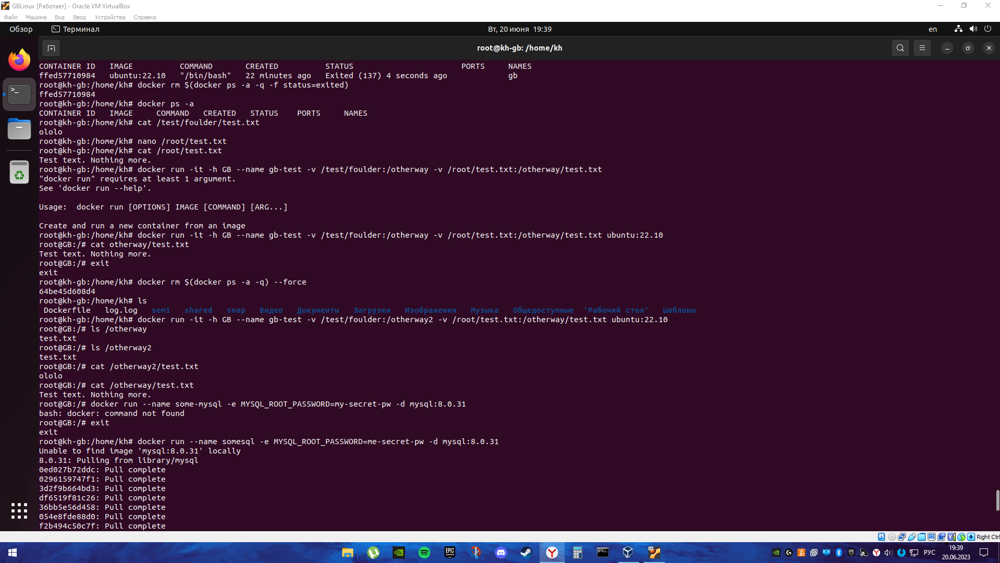
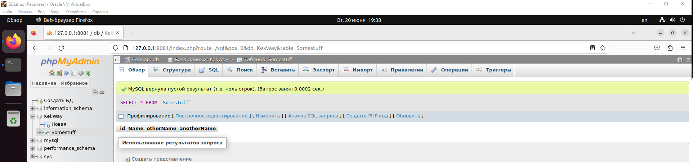
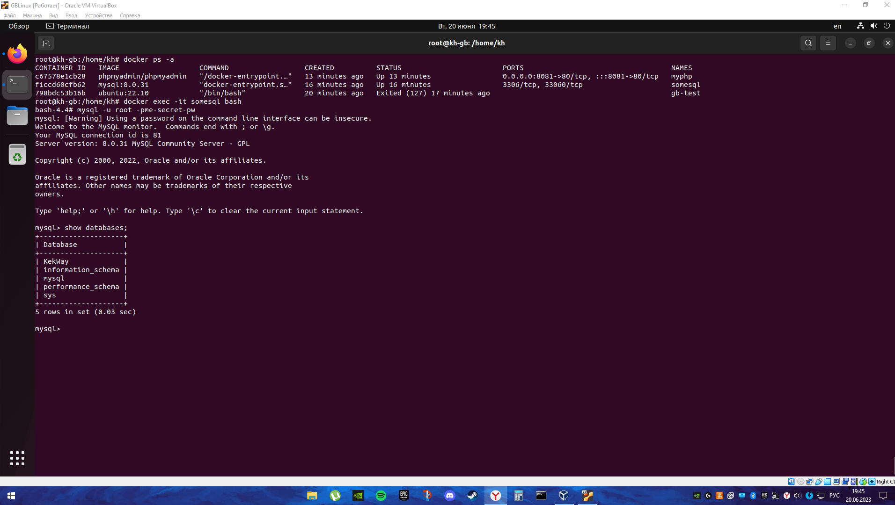

# Контейнеризация ДЗ №3

## Задание 1.
1. Создать папку, которую мы будем готовы смонтировать в контейнер
2. В этой папке создать файл test.txt и наполнить данными
3. В домашней директории создать файл test.txt, который также необходимо будет смонтировать в контейнер и наполнить совершенно другими данными
4. Создать контейнер из образа ubuntu:22.10
5. Задать ему имя
6. Задать hostname
7. Смонтировать созданную ранее папку с хоста в контейнер
8. Смонтировать созданный ранее текстовый файл внутрь смонтированной папки, чтобы он пересекался с созданным ранее файлом в этой папке. 
9. Просмотреть этот файл.


Очень повезло, что это, по сути влезло на один скрин.



Поясняю:

Имеем два файла на разных путях, а именно
`home/test/foulder/test.txt` и `root/test.txt`

Запускаем контейнер на `ubuntu 22.10` с именем `gb-test`, хостнеймом `GB`, а еще с общими с хостом двумя файлами по путям, указанным выше одной командой.

`docker run -it -h GB --name gb-test -v /test/foulder:/otherway2 -v /root/test.txt:/otherway/test.txt ubuntu:22.10`

Самый сок в том, что по сути мы передали в запуск нашего контейнера две переменные, содержащие пути. Если бы переменные назывались одинаково, то передался бы только один путь, последний. Называю это переменными, потому что эта перезапись очень напоминате переопределение переменной в python.

Теперь из контейнера мы можем обращаться по этим путям для чтения или же записи текста. На семинаре все говорили, что это полезно для настроек и тд, но я думаю, что можно туда сливать логи из, допустим серверной части приложения, чтобы не ползать в контейнер с этой приложухой и не смотреть логи там, а видеть все как на ладони из хостового сервера. Короче, мрак, надо думать.


## Задание 2.
1. запустить контейнер с БД, отличной от mariaDB, используя инструкции на сайте: https://hub.docker.com/
2. добавить в контейнер hostname такой же, как hostname системы через переменную
3. заполнить БД данными через консоль
4. запустить phpmyadmin (в контейнере) и через веб проверить, что все введенные данные доступны


```docker run --name somesql -e MYSQL_ROOT_PASSWORD=me-secret-pw -d mysql:8.0.31```

Команда для запуска mysql

```docker run --name myphp -d --link some-mysql:db -p 8081:80 phpmyadmin/phpmyadmin```

Команда для запуска phpmyadmin

Тут важны один момент:

1. Пароль от БД, который сейчас `me-secret-pw` и порт для admin-а `8081` надо запомнить, пригодится. 

Запустили, чекнули `docker ps -a`, лезем в этот ваш инторнет. Вбиваем в адреску `localhost:(порт, мой вот равен 8081, я запомнил))` и ловим в лицо логин-форму, куда вводим юзернейм root и пароль, который я просил запомнить. Далее я немного увлекся и создал бд в интерфейсе, а не в консоли, каюсь, но работает же, вот увидите.



БД KekWay готова, милорд. Топаем в терминал проверять.

```docker ps -a
docker exec somesql
docker exec -it somesql bash
show databases
```



Видим нашу БДшечку и радуемся.

### Послесловие

Словил рекурсивную головную боль от осознания проделланых действий. Я на своем пк запустил ВМ на линуксе, где запустил контейнер с бд, куда по итогу зашел.

Осознание пришло, когда пришлось писать `exit` многораз. Сначала с БД, потом с контейнера, потом с суперюзера, ужс.