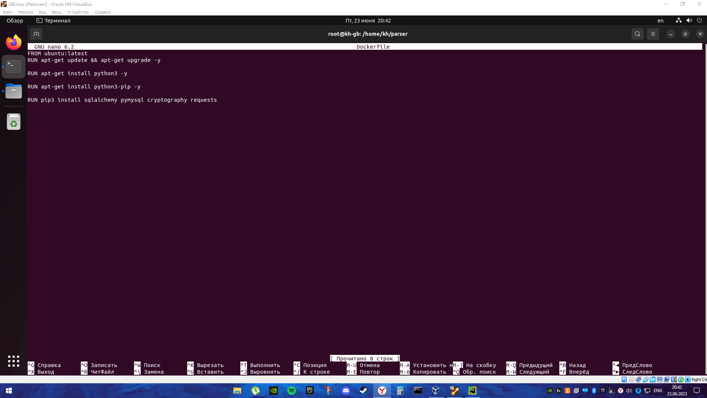
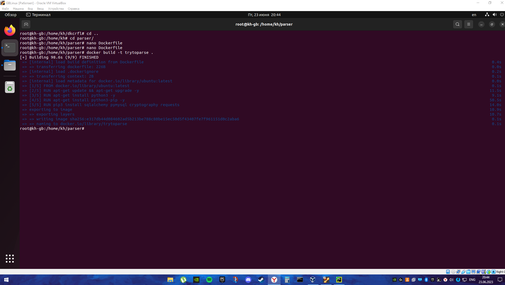
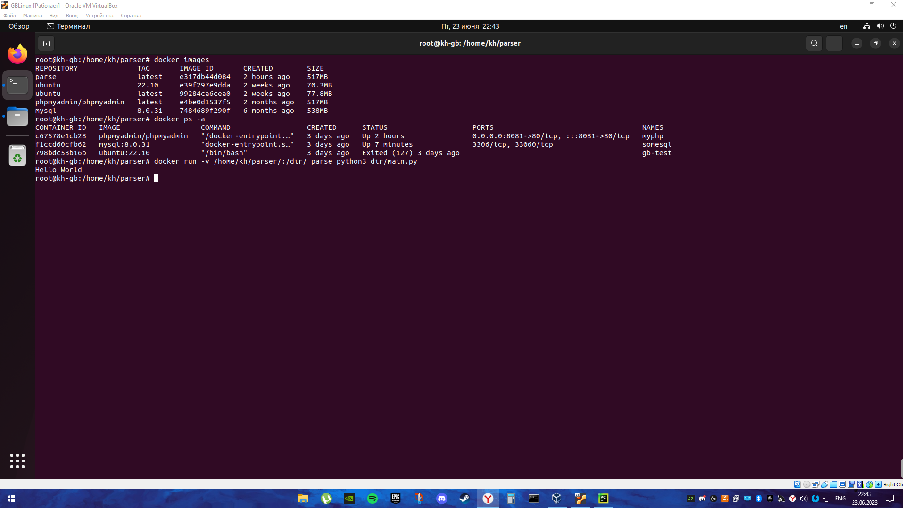
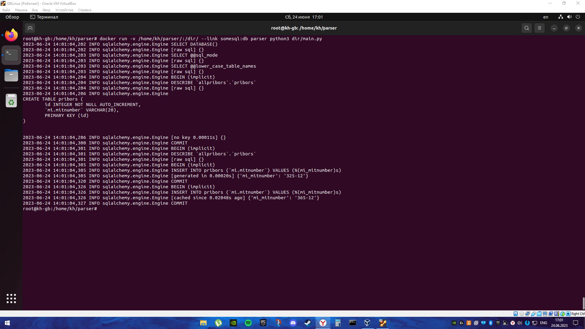
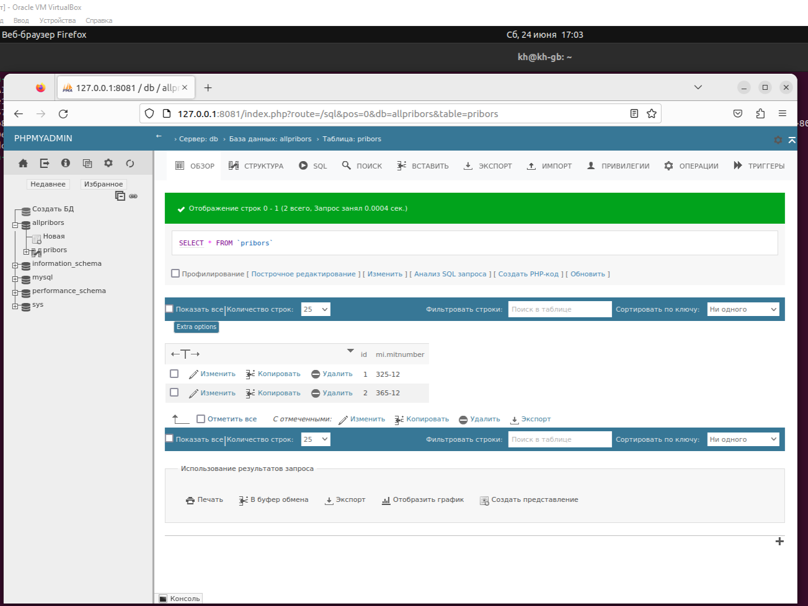

# ДЗ №4. Контейнеризация

## Задание:
1. Необходимо создать Dockerfile, основанный на любом образе (вы в праве выбрать самостоятельно).
2. В него необходимо поместить приложение, написанное на любом известном вам языке программирования (Python, Java, C, С#, C++).
3. При запуске контейнера должно запускаться самостоятельно написанное приложение.

Казалось бы, ничего страшного, но эта домашка была самой больной и мучительной, вместо двух часов на выполнение и оформление я потратил почти 23.

## Акт 1. Пилим Dockerfile

Для начала нам надо сделать папку, куда мы помести свой Dockerfile и программу. Для этого юзаем команду ```mkdir  parser``` в домашней дирректории. Cd туда и там создаем файлик с названием Dockerfile.

```nano Dockerfile```

Мы хотим использовать в контейнере python и его библиотеки, вот они слева направо: ```requests, sqlalchemy, cryptography``` и ```pymysql```

Наш контейнер как чистый лист, не умеет ничего, пока мы его не научим и сначала надо залить в него операционку, с которой он будет работать. Останавливаем наш выбор на ```ubuntu:latest```.

```FROM ubuntu:latest```

Теперь мы можем использовать стандартные утилиты ubuntu, например ```apt-get```. Не тянем время и устанавливаем в контейнер ```python3```. 

```RUN apt-get install python3 -y```

Наш питон жив-здоров, однако у него нет ```pip```, поэтому следующим шагом устанавливаем через ```apt-get``` и его. 


```RUN apt-get install python3-pip -y```

Последним шагом будет установка наших библиотек в контейнер посредством вызова пипа.

```RUN pip3 install sqlalchemy pymysql cryptography reuests```



Мы молодцы? Определенно. Сохраняемся, выходим.

Мы сотворили Dockerfile. Теперь нам надо забильдить его в image, который можно будет запускать.

## Акт 2. Билдим и проверяем.

Для билда из Dockerfile нам надо юзнуть команду 

``` docker build -t parser .``` 

Точка в конце строки обязательна, потому что является заглушкой для пути, где лежит наш Dоckerfile. Если интерпретировать текст команды то выйдет что-то из разряда "Собери мне образ контейнера из докерфайла, который лежит прям тут". 



Полностью синий текст означает, что мы нигде не ошиблись и можем пытаться запускать наш контейнер.

## Акт 3. Учись на чужих ошибках

Для запуска контейнера нам нужно выполнить команду

```docker run parser```

Но файлик с нашей программой не переносится в контейнер, поэтому передадим его тут. 

```docker run -v /home/kh/parser/:/dir/ parser python3 dir/main.py```

Поясняю: часть про -v это добавление путей в контейнер. Конкретно тут мы переносим папку с файлом main.py в папку dir внутри контейнера. Очень важно, чтобы вы не облажались с расстановкой слешей. Пути в такой команде должны быть АБСОЛЮТНЫМИ, то есть выделяться слешами с двух сторон. А дальше обращаемся к установленному в контейнере python и просим его выполнить програмку main.py



Ничего сложного, вывели Hello World, все работает, можно закрывать это дз и идти наматывать хвосты коровам.

ALARM ALARM DANGER ZONE BIOHAZARD дальше жду только храбрецов.

Я решил усложнить себе жизнь и попытаться из контейнера с программкой отправить данные в другой контейнер с базой данных, которая в свою очередь будет отправлять данные на третий контейнер с phpmyadmin для того, чтобы мои боярские глазки не уставали смотря на терминал 24/7 а показали красивое.

Я потратил на это милион лет и 300 пустых бутылок для моих слезок и вот почему. Програмка моя является парсером, который должен отправлять запрос в инторнет и возвращать полученный ответ в бд. У меня была одна проблемка.

Сайт, который я должен был парсить ЛЕЖАЛ. Естественно я об этом не знал и долбился туда 2 дня. Узнал я об этом, когда совсем отчаялся и попытался зайти просто на него, вспомнить как он выглядит. 

Снабдив программку статичными значениями, имитирующими ответ от запроса я попытался запустить контейнер снова и ловил постоянно одну и ту же ошибку. Контейнеры никак не хотели дружить. И вот тут чуток полезной информации.

Контейнеры надо связывать друг с другом, добавляя параметр ```--link```.

В итоге наш финальный запрос будет выглядить как 

```docker run -v /home/kh/parser/:/dir/ --link somesql:db parser python3 dir/main.py```

Эта добав очка будет связывать нашу бд с программой и ошибок не будет.



Если сползать в phpmyadmin, то увидим мы тут прекрасное.



База заполнена, значения на месте. Я закончил.