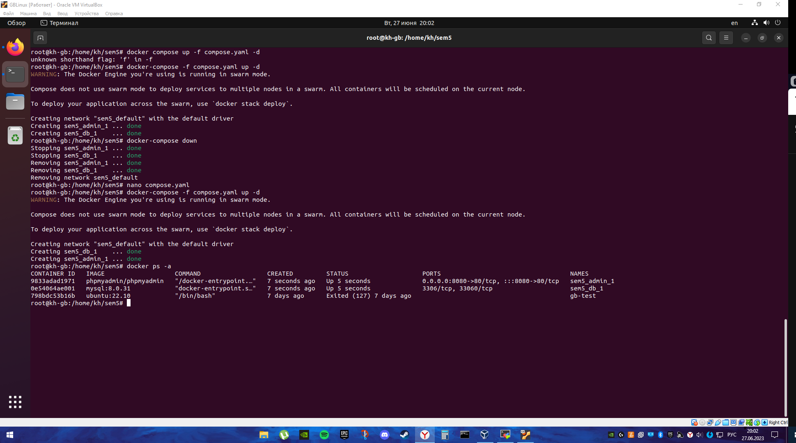
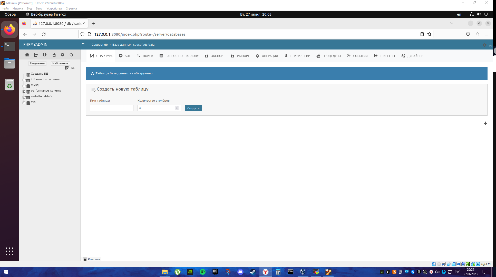
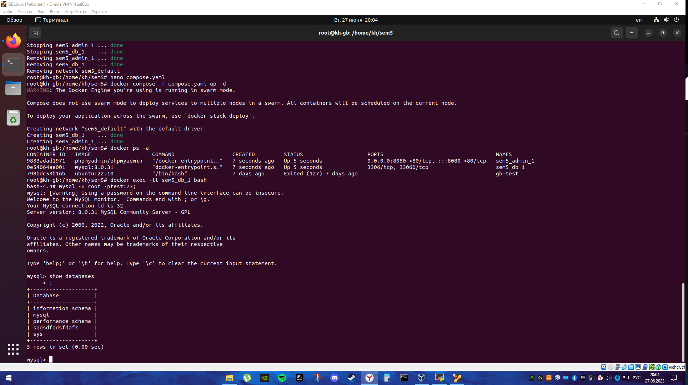
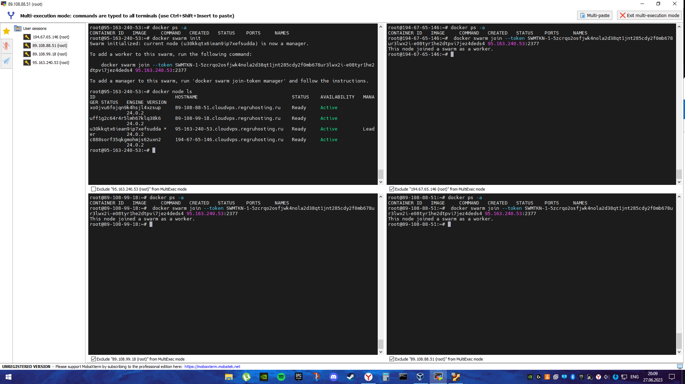
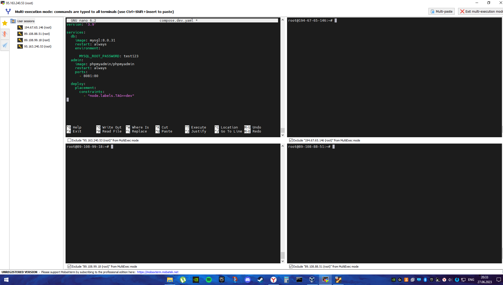
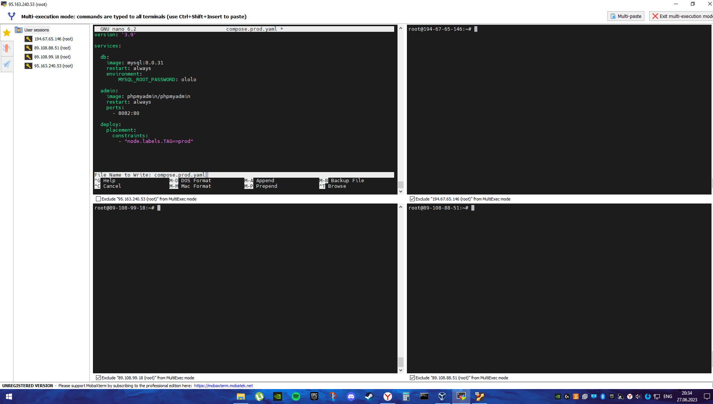
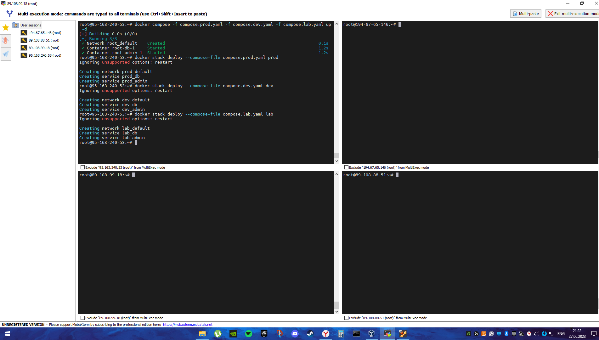
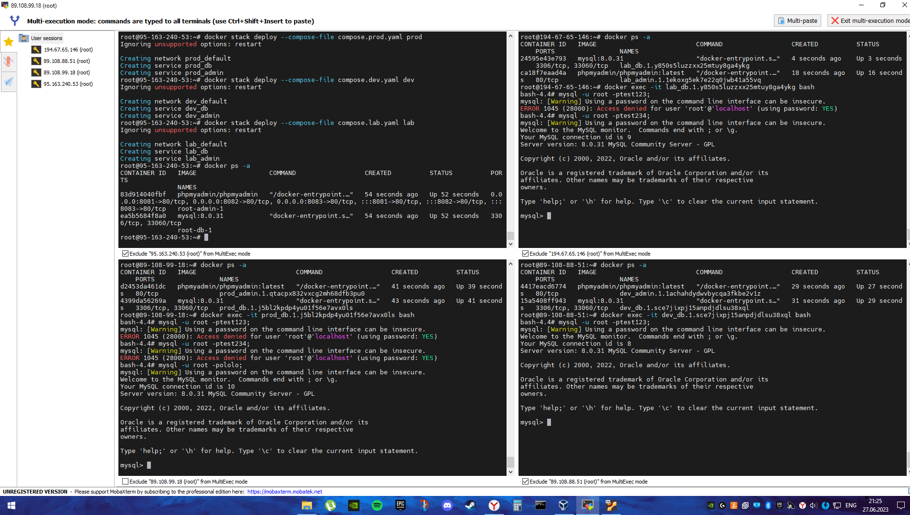

# Контейнеризация. ДЗ №5.

## Задание

1. создать сервис, состоящий из 2 различных контейнеров: 1 - веб, 2 - БД

2. необходимо создать 3 сервиса в каждом окружении (dev, prod, lab)
3. по итогу на каждой ноде должно быть по 2 работающих контейнера
4. выводы зафиксировать


## Задача 1. Разогревочная.

По сути, там делать нечего, на семинаре у нас был yaml-файлик, который содержит всю информацию о нашем проекте. Юзаем команду

```docker-compose up -d```

и гуляем.



Поставил флаг -f потому что у меня в той папке были другие yaml-файлы и флаг указывает, что конкретно апать.



Топаем в браузер проверять. Пилим билебердовую бд и посмотрим в терминале, как оно выглядит.



Буквовое, билеберда на месте, задание выоплнено.

## Задание 2, 3, 4. Жаришка.

По условию задания, нам надо создать три окружения и в создать кластер, состоящий из одного менеджера и трех работников. Таким образом, нам надо запилить 4 виртуальных машины в одном сетевом пространстве и все это дело провернуть там. Но, мои компы не в состоянии потянуть такую нагрузку, поэтому я поперся нести монету капиталистическим чувачкам. А именно на reg.ru. Закинув туда кровно заработанную сотыгу и арендовав сервера я, скрипя душой пошел качать ssh-клиент для красивого отображения этих самых окон. Мое еврейское чутье никогда еще так не кричало.

В итоге все настроив и включив, имеем это. ~~самая жесть это ставить докер на все эти серваки вручную~~



Немного текста. Верхний левый терминал назначен главным, потому что на нем я ввел основную команду для создания swarm

```docker swarm init```

а потом просто заджойнился всеми остальными серверами к главному. Для проверки вводим команду ```docker node ls```

Все нодки активны, полны жизни, хоть и пусты.


Далее нам надо настроить сами окружения, для этого создадим каждой группе свой Yaml-файл. Соответственно вот они слева направо.

Для окружения dev


Для оокружения lab


Для окружения prod


Тут есть ошибка, прошу прощения, только сейчас заметил и не могу исправить, потому что удалил сервера. Попробую объяснить словами.

Параметр deploy в наших файлах отвечает за то, в какое окружение мы должны отправить наши контейнеры. В нашем случае это тэг. Тэг можно присвоить любой рабочей ноде в swarm командой

```docker node update --label-add TAG=(имя тэга) (хостнэйм)```
 
то есть

```
docker node update --label-add TAG=dev (многацифорбезскобочек)

docker node update --label-add TAG=prod (многацифорбезскобочек)

docker node update --label-add TAG=lab (многацифорбезскобочек)
```

Это мы отвлеклись чуть-чуть. Ошибка на скринах заключается в том, что этот параметр надо передавать В КАЖДЫЙ ОБРАЗ, то есть и в db и в admin. И не забудьте про табуляцию. Только тогда все поедет без проблем.

А еще мы сразу подготовили почву для проверки домашки, задав базам данных на разных окружениях разный пароль, это позволит нам не заходя в phpmyadmin ~~еще бы, серваки без видях~~ посмотреть правильность выполнения нашего безобразия.

Расписав yamlы, разметив ноды мы, наконец, можем начинать деплой. Не, не так. ДЕ-Е-Е-Е-ПЛОЙ.

Для начала на главной ноде замутим compose всех наших yamlов в режиме демона одновременно командой

```docker compose -f compose.prod.yaml -f compose.dev.yaml -f compose.lab.yaml up -d```

Это создаст сервисы на главной ноде и можно будет приступать к раскидке.

Раскидка выполнятеся командой 

```
docker stack deploy --compose-file <имя файла> <сетевая группа>

а иначе говоря

docker stack deploy --compose-file <compoose.dev.yaml> dev

docker stack deploy --compose-file <compoose.prod.yaml> prod

docker stack deploy --compose-file <compoose.lab.yaml> lab
```

Про сетевые группы тоже есть что сказать. Я пробовал кидать это все в одну сетевую группу, но идея оказалось так себе по двум причинам. 

1. Если нам надо что-то подшаманить в одной из групп - улетает вся группа.

2. Контейнеры не дружат с представителями разных окружений. То есть они буквально перебивают друг друга, отключая собратьев, дабы запуститься самим. Вот такая контейнерная ксенофобия.

Результат команд видим на скрине.



Финалочка, можно проверять. Микропроверку можно организовать, проверив порты на главной ноде у phpmyadmin. Проверку не курильщика осуществляем залезанием ручками в каждый контейнер и инициализацией сначала bash а потом mysql.

```
docker exec -it <имя коннтейнера в группе> bash

mysql -u <имя юзверя> -p<пароль>
```


Благодаря мультиоконному вводу в ssh-клиенте, мы можем прописать инициализацию mysql сразу во все окна, поочередно набирая пароли, куда-то да попадем.



По своему паролю пускает, по чужим нет. Окружения изолированы, задание выполнено. Я спать.